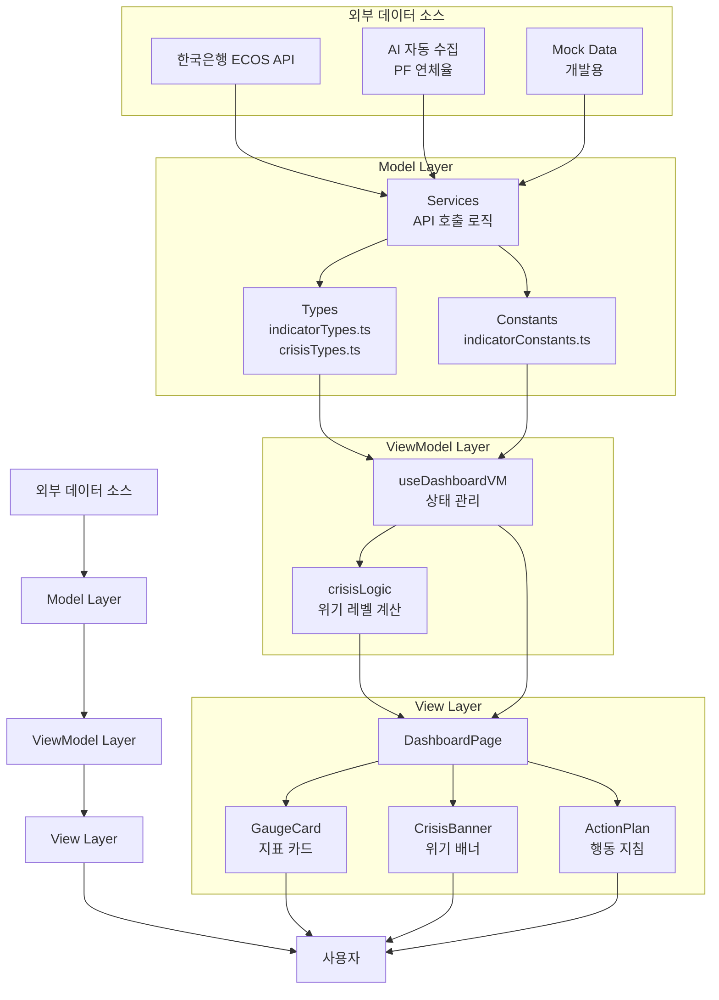
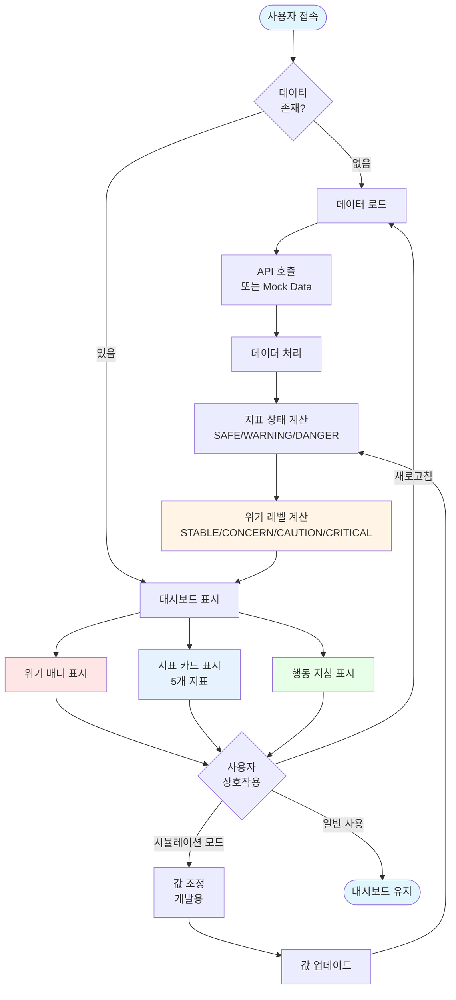
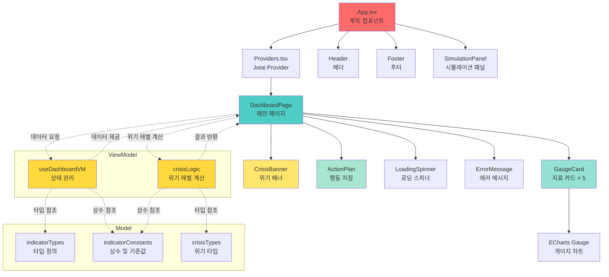
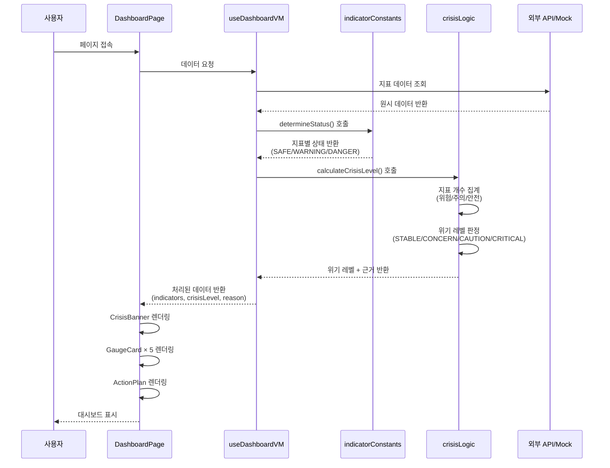
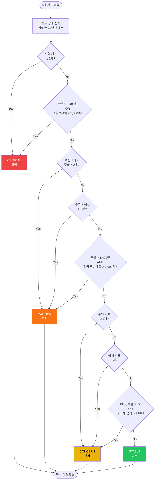

# K-Economy Sentinel (경제 위기 감지 대시보드)

> "당신만 모르는 5가지 징후"를 한눈에 파악하여 경제 위기를 감지하는 대시보드입니다.

한국 경제 파수꾼 - 5대 핵심 경제 지표(금리, 환율, 외환, PF, 수급)를 실시간으로 모니터링하고 위험도를 직관적으로 표시하는 웹 서비스입니다.

## 📋 프로젝트 개요

- **프로젝트명**: K-Economy Sentinel (한국 경제 파수꾼)
- **한 줄 소개**: 5대 핵심 경제 지표 실시간 모니터링 서비스
- **개발 기간**: 2025.12.21 ~ (진행 중)
- **기획 의도**: 경제 지식이 부족한 사람도 신호등(🟢/🟡/🔴) 색상으로 위기 수준을 직관적으로 파악
- **업데이트 주기**: Daily (매일 자정 또는 사용자 첫 접속 시)
- **아키텍처 패턴**: MVVM (Model - View - ViewModel)

## 🎯 주요 기능

1. **위기 감지 신호등**: 5가지 지표의 현재 값을 기준치와 비교하여 위험도 표시
2. **실시간 대시보드**: 카드를 통한 데이터 시각화
3. **지표별 상세 코멘트**: "왜 위험한가?"에 대한 간단한 설명 제공
4. **데이터 수집 시간 표시**: 각 지표의 최신 업데이트 시간을 상대 시간으로 표시
5. **반응형 디자인**: 모바일, 태블릿, 데스크톱 모든 환경 지원

## 📊 모니터링 지표

| 지표                   | 설명                      | 위험 기준                    | ECOS API 코드 | 데이터 기준 |
| ---------------------- | ------------------------- | ---------------------------- | ------------- | ----------- |
| **국고채 10년물 금리** | 내부 시스템 균열의 예고편 | 4.0% 이상                    | -             | 일일        |
| **원/달러 환율**       | 위험의 신호탄             | 1,470원 이상                 | -             | 일일        |
| **외환보유액**         | 방어선의 체력             | 4,000억 달러 미만            | -             | 월간        |
| **PF 대출 연체율**     | 폭탄 뇌관의 온도          | 10% 이상                     | -             | 월간        |
| **외국인 순매수**      | 국내 주식/채권 순매수     | 순매도 5,000억원 이상 (위험) | 802Y001       | 일일        |

> **참고**: 외국인 순매수(802Y001) 데이터 형식
>
> - **양수**: 순매수 (긍정적 신호)
> - **음수**: 순매도 (부정적 신호)
> - **데이터 기준**: 일일 기준 (일별 거래 데이터)
> - **단위**: 억원

## 🛠 기술 스택

### 프론트엔드

- **React**: ^19.2.1 - 최신 React 기능 활용
- **TypeScript**: ^5.9.3 - 타입 안정성 보장
- **Vite**: ^7.2.6 - 빠른 개발 서버 및 빌드
- **jotai**: ^2.16.1 - 경량 상태 관리 라이브러리
- **Tailwind CSS**: ^4.1.18 - 유틸리티 퍼스트 CSS 프레임워크
- **lucide-react**: ^0.562.0 - 아이콘 라이브러리

### 개발 도구

- **@vitejs/plugin-react-swc**: ^4.2.2 - SWC를 사용한 Fast Refresh
- **ESLint**: ^9.39.1 - 코드 린팅
- **TypeScript ESLint**: ^8.48.1 - TypeScript 전용 ESLint 규칙
- **Prettier**: ^3.7.4 - 코드 포맷팅
- **Vitest**: ^4.0.16 - Vite 네이티브 테스트 프레임워크
- **@vitest/ui**: ^4.0.16 - Vitest UI 인터페이스
- **jsdom**: ^27.4.0 - DOM 환경 시뮬레이션
- **Testing Library**: React 컴포넌트 테스트

### 배포

- **Vercel**: 프론트엔드 및 Serverless Functions 호스팅

## 🏗 아키텍처

### MVVM 패턴

프로젝트는 **MVVM (Model - View - ViewModel)** 패턴을 엄격하게 따릅니다:

- **Model**: 데이터 타입 정의, 상수, 서비스 레이어 (API 호출 로직)
- **ViewModel**: 비즈니스 로직, 상태 관리, 데이터 가공 (UI 의존성 없음)
- **View**: UI 컴포넌트, 스타일링 (비즈니스 로직 없음)

이 패턴을 통해 관심사의 분리와 코드 재사용성을 극대화합니다.

### 데이터 흐름

```
API/Service → Model → ViewModel → View
```

## 📐 시스템 다이어그램

이 섹션은 PRD 기반으로 작성된 시스템 아키텍처 다이어그램입니다. 각 다이어그램은 시스템의 다른 관점을 보여줍니다.

### 1. 데이터 흐름도 (DFD - Data Flow Diagram)

시스템의 데이터 흐름을 보여주는 다이어그램입니다. 외부 데이터 소스부터 사용자까지의 데이터 흐름을 MVVM 패턴에 따라 표현합니다.



### 2. 시스템 플로우 차트

사용자 접속부터 대시보드 표시까지의 전체 시스템 플로우를 보여줍니다. 데이터 로드, 상태 계산, UI 렌더링, 사용자 상호작용 등의 단계를 포함합니다.



### 3. 컴포넌트 구조도

React 컴포넌트의 계층 구조와 의존성을 보여줍니다. MVVM 패턴에 따라 Model, ViewModel, View 레이어 간의 관계를 표현합니다.



### 4. 데이터 처리 플로우 (Sequence Diagram)

시스템의 데이터 처리 과정을 시간 순서대로 보여주는 시퀀스 다이어그램입니다. 사용자 요청부터 데이터 조회, 처리, 렌더링까지의 전체 과정을 표현합니다.



### 5. 위기 레벨 계산 로직 플로우

5개 경제 지표를 기반으로 종합 위기 레벨을 계산하는 로직의 플로우차트입니다. 지표 개수 기반 판정 로직과 각 레벨별 판정 조건을 시각화합니다.



## 📁 프로젝트 구조

```
src/
├── models/                    # [Model] 데이터 레이어
│   ├── types/                 # TypeScript 인터페이스 정의
│   │   ├── indicatorTypes.ts  # 경제 지표 타입
│   │   └── crisisTypes.ts     # 위기 레벨 타입
│   ├── constants/             # 상수 및 기준값 정의
│   │   └── indicatorConstants.ts  # 지표 기준값 및 메타데이터
│   └── services/              # API 호출 로직 (향후 구현)
│
├── viewmodels/                # [ViewModel] 비즈니스 로직 레이어
│   └── useDashboardVM.ts      # 대시보드 상태 관리
│
├── views/                     # [View] UI 레이어
│   ├── pages/                 # 페이지 컴포넌트
│   │   └── DashboardPage.tsx  # 메인 대시보드 페이지
│   └── components/            # 재사용 가능한 컴포넌트
│       ├── layout/            # 레이아웃 컴포넌트
│       │   ├── Header.tsx     # 헤더
│       │   └── Footer.tsx     # 푸터
│       ├── indicator/         # 지표 관련 컴포넌트
│       │   └── GaugeCard.tsx  # 게이지 카드 (ECharts)
│       ├── crisis/             # 위기 관련 컴포넌트
│       │   ├── CrisisBanner.tsx  # 위기 배너
│       │   └── ActionPlan.tsx    # 행동 지침
│       ├── common/             # 공통 컴포넌트
│       │   ├── LoadingSpinner.tsx  # 로딩 스피너
│       │   └── ErrorMessage.tsx    # 에러 메시지
│       └── simulation/         # 시뮬레이션 컴포넌트
│           └── SimulationPanel.tsx  # 시뮬레이션 패널 (개발용)
│
├── utils/                     # 유틸리티 함수
│   └── crisisLogic.ts         # 위기 레벨 계산 로직
│
└── app/                       # 애플리케이션 진입점
    ├── App.tsx                # 메인 App 컴포넌트
    └── Providers.tsx          # Context Provider 래핑
```

## 🚀 시작하기

### 사전 요구사항

- Node.js 18 이상
- pnpm 8 이상

### 설치

```bash
pnpm install
```

### 개발 서버 실행

```bash
pnpm dev
```

기본 포트는 5173입니다. 다른 포트(예: 3000)를 사용하려면:

```bash
pnpm dev:3000
```

### 빌드

```bash
pnpm build
```

### 프로덕션 미리보기

```bash
pnpm start
```

### 테스트

```bash
# 테스트 실행
pnpm test

# Watch 모드로 테스트 실행
pnpm test:watch

# UI 모드로 테스트 실행
pnpm test:ui

# 커버리지 포함 테스트 실행
pnpm test:coverage
```

### 린트

```bash
pnpm lint
```

## 📝 코딩 컨벤션

### 네이밍 규칙

- **상수**: 대문자로 정의 (예: `THRESHOLD_BOND_RATE_SAFE`)
- **폴더명**: 스네이크 케이스 (예: `use_dashboard_vm.ts`)
- **함수/변수**: 카멜 케이스 (예: `useDashboardVM`)

### 코드 스타일

- **ES6 문법 지향**: Arrow Function 사용
- **하드코딩 지양**: 모든 값은 상수로 정의
- **SRP 원칙**: 각 컴포넌트/함수는 단일 책임
- **타입 안정성**: TypeScript strict 모드 활성화

### Path Alias

프로젝트는 다음 path alias를 사용합니다:

- `@models/*` → `src/models/*`
- `@viewmodels/*` → `src/viewmodels/*`
- `@views/*` → `src/views/*`
- `@app/*` → `src/app/*`
- `@assets/*` → `src/assets/*`

## 🔧 설정 파일

- `vite.config.ts` - Vite 빌드 설정 및 path alias
- `tailwind.config.js` - Tailwind CSS 커스텀 설정
- `postcss.config.js` - PostCSS 플러그인 설정
- `vitest.setup.ts` - Vitest 테스트 설정 파일
- `eslint.config.js` - ESLint 린팅 규칙 (Flat Config 형식)
- `tsconfig.json` - TypeScript 컴파일러 설정
- `tsconfig.path.json` - Path alias 설정

## 🎨 UI/UX 특징

- **신호등 색상 시스템**: SAFE(🟢), WARNING(🟡), DANGER(🔴)
- **반응형 그리드**: 모바일(1열), 태블릿(2열), 데스크톱(3열)
- **상대 시간 표시**: "N분 전", "N시간 전" 등 직관적인 시간 표시
- **호버 효과**: 카드에 마우스 오버 시 그림자 효과

## 🔮 향후 계획

- [ ] 한국은행 ECOS API 연동
- [ ] AI 기반 PF 연체율 자동 수집 (OpenAI + Vercel KV)
- [ ] 차트 시각화 (Recharts)
- [ ] 지표별 상세 페이지/모달
- [ ] 다크 모드 지원
- [ ] PWA 지원

## 📄 라이선스

MIT

## 👥 기여

이슈 및 풀 리퀘스트를 환영합니다. 프로젝트를 개선하기 위한 제안이 있으시면 언제든지 알려주세요.
